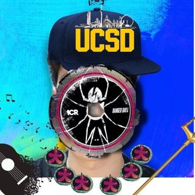

# Xun Liu 柳逊

> Start early, start often.

---
## **MENU**
---
  - [**BIO**](#bio)
  - [**SKILLS**](#skills)
  - [**Leetcode Example**](#leetcode-example)
  - [**CHECKLIST**](#checklist)
  - [EASTEREGG](profiles/Face-Reveal.jpg)

## **BIO**
---
Hi, I'm Xun Liu 柳逊, 3rd year Computer Engineering student from Tianjin, China. I choose this major because solving prolems with softwares is fun and useful. I'm currently looking for an intern position in software engineering.

When I'm not studying computer or looking for a job, I play and make music with guitar, keybaord, and bass. I'm also enthusiastic about skateboarding, especially freestyle skateboarding.

Let me know if we share the same hobby, interest, or career goals :)
## **SKILLS**
---
1. **Language & Tools**
   - Good command of ***Python, Java, C, C++ language***
   - Proficient use of ***Vim and VS Code*** operations
2. **Academic Commands**
   - Proficiency ***in circuit analysis*** and ***circuit assembling***
   - Good command of ***Calculus*** and ***complex number calculation***
   - Proficiency in using ***Zoom functions***, ***screen projection***, and other electronic teaching facilities
3. **Communication Abilities**
   - Proficiency in explaining class material in ***words and drawings***
   - Proficiency in ***communication*** and ***teamwork skills***

### **Videos**
---
1.  
   [Show What You Know: Explain Your Program](https://github.com/Atomgroup530/CSE-110-FA22.git)
2. [Show What You Know: Write and Explain A Program](https://youtu.be/sWH7XdNIsEY)